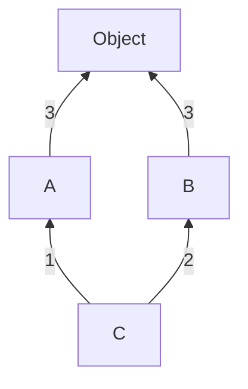

#  Learning Python 

| Contents                                  |
| :---------------------------------------- |
| [Exception Handling](#exception-handling) |
| [OOPs in Python](#oops-in-python)         |

## Exception Handling

```python
try:
    num = int(input("Enter a number: "))
    result = 10 / num
except ZeroDivisionError:
    print("Cannot divide by zero.")
else:
    print(f"Result: {result}")  # Only executes if no exception occurs
finally:
    print(f"Result: {result}")  # Executes every time - Mostly utilized for clean up purposes
```

### Raising Exceptions Manually (`raise`)

```python
def check_age(age):
    if age < 18:
        raise ValueError("Age must be 18 or above.")
    return "Access granted."

try:
    print(check_age(16))
except ValueError as e:
    print(f"Error: {e}")
```

### Writing Custom Exceptions

```python
class FileProcessingError(Exception):
    def __init__(self, message, filename, lineno):
        super().__init__(message)
        self.message = message
        self.filename = filename
        self.lineno = lineno

    def __str__(self):
        # return f"{self.args[0]} in {self.filename} at line {self.lineno}" # if `self.message` is not declared inside `__init__`
        return f"{self.message} in {self.filename} at line {self.lineno}"

try:
    raise FileProcessingError("Syntax error", "example.txt", 13)
except FileProcessingError as e:
    print(f"Caught an error: {e}")
```

### Raising & Handling Multiple Exception Group (Python 3.11+ feature)

```python
# raising multiple exception group

def process_files():
    raise ExceptionGroup(
        "File Processing Errors",
        [
            FileNotFoundError("config.json not found"),
            PermissionError("Access denied for logs.txt"),
            ValueError("Invalid data format in data.csv"),
        ],
    )
process_files()
```

```python
# raising & handling multiple exception group
# check the way `except` is used
def process_files():
    errors = []

    try:
        # Simulating multiple errors
        raise ExceptionGroup(
            "File Processing Errors",
            [
                FileNotFoundError("config.json not found"),
                PermissionError("Access denied for logs.txt"),
                ValueError("Invalid data format in data.csv"),
            ],
        )
    except* FileNotFoundError as e:
        print(f"Handling FileNotFoundError: {e}")
    except* PermissionError as e:
        print(f"Handling PermissionError: {e}")
    except* ValueError as e:
        print(f"Handling ValueError: {e}")

process_files()
```

### Enriching Exceptions with Notes (Python 3.11+)

```python
try:
    with open("config.json", "r") as f:
        data = f.read()
except FileNotFoundError as e:
    e.add_note("Make sure the config.json file exists in the directory.")
    e.add_note("You might need to provide a correct file path.")
    raise

# Output

"""
Traceback (most recent call last):
  File "example.py", line 2, in <module>
    with open("config.json", "r") as f:
FileNotFoundError: [Errno 2] No such file or directory: 'config.json'
    Make sure the config.json file exists in the directory.
    You might need to provide a correct file path.
"""
```

Readings:

- [Errors and Exceptions (Official Docs)](https://docs.python.org/3/tutorial/errors.html)

## OOPs in Python

### Method Resolution Order

Check this [Stack Overflow](https://stackoverflow.com/a/62753514/12681221) answer to understand MRO.

**Different Case**

```python
class A:
    def __init__(self):
        print("Before - I am in Class A")
        super().__init__()
        print("I am in class A")

class B:
    def __init__(self):
        print("Before - I am in Class B")
        super().__init__()
        print("I am in class B")

class C(A,B):
    def __init__(self):
        print("Before - I am in Class C")
        super().__init__()
        print("I am in class C")

obj = C()
print(C.__mro__)

# Output

"""
Before - I am in Class C
Before - I am in Class A
Before - I am in Class B
I am in class B
I am in class A
I am in class C
(<class '__main__.C'>, <class '__main__.A'>, <class '__main__.B'>, <class 'object'>)
"""
```



Explanation:

1. ⁠When an instance of class `C` is created (`obj=C()`), it invokes the `__init__()` method of class `C`.
2. Inside the `__init__()` method of class `C`, it first prints `Before - I am in class C`.
3. Then, it calls `super().__init__()`, which invokes the `__init__()` method of the next class in the method resolution order (MRO) of class `C`, which is class `A`.
4. ⁠Inside the `__init__()` method of class `A`, it prints `Before - I am in class A`.
5. ⁠Then, it calls `super().__init__()`, which invokes the `__init__()` method of the next class in the MRO of class `C` (not class `A`), which is class `B`.
6. ⁠Inside the `__init__()` method of class `B`, it prints `Before - I am in class B`.
7. ⁠Then, it calls `super().__init__()`, which invokes the `__init__()` method of the next class in the MRO of class `C`, which is the built-in `object` class. Since `object` doesn't have an explicit `__init__()` method, it does nothing.
8. ⁠After the `super().__init__()` call in class `B`, it prints `I am in class B`.
9. The execution returns to class `A`, and after the `super().__init__()` call, it prints `I am in class A`.
10. Finally, the execution returns to class `C`, and after the `super().__init__()` call, it prints `I am in class C`.

The key point to understand is that when `super().__init__()` is called in class `A`, it doesn't transfer the execution to class `B` based on the inheritance between `A` and `B`. Instead, it looks at the MRO of the class where the instance is being created, which is class `C`. The MRO of class `C` determines the order in which the `super()` calls are resolved.

In this case, the MRO of class `C` is (`<class '__main__.C'>, <class '__main__.A'>, <class '__main__.B'>, <class 'object'>`). So, when `super().__init__()` is called in class `A`, it transfers the execution to the next class in the MRO after `A`, which is class `B`.

Readings:

- [Python Multiple Inheritance – Python MRO (Method Resolution Order)](https://data-flair.training/blogs/python-multiple-inheritance/)
