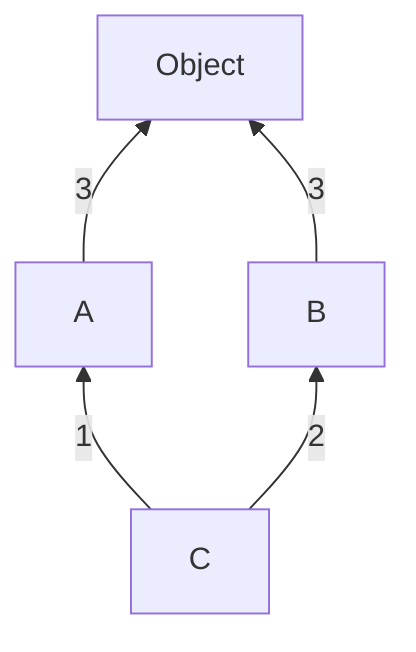

#  Learning Python 

| Contents                                              |
| :---------------------------------------------------- |
| [Fundamentals](#fundamentals)                         |
| [Exception Handling](#exception-handling)             |
| [OOPs in Python](#oops-in-python)                     |
| [Iterators and Iterables](#iterators-and-iterables)   |
| [Generator](#generator)                               |
| [Closures](#closures)                                 |
| [Decorators](#decorators)                             |
| [Context Managers](#context-managers)                 |
| [`typing` module in Python](#typing-module-in-python) |

## Fundamentals

### Walrus Operator

The walrus operator (`:=`), **_introduced in Python 3.8_**, is an assignment expression that allows you to assign a value to a variable within an expression. It helps reduce redundancy and improves readability by allowing assignment and usage in a single line.

**Syntax**

```python
variable := expression
```

where,

- `:=` assigns the value of expression to variable and returns the value.
- It can be used inside loops, conditions, and comprehensions.

#### Basic Example

```python
if (n := len("Hello")) > 3:
    print(f"Length is {n}")  # Output: Length is 5

# n := len("Hello") assigns len("Hello") to n inside the if condition.
# No need to calculate len("Hello") separately before the if condition
```

#### Using Walrus Operator in a While Loop

```python
# Without := (Traditional Way)

data = input("Enter data: ")
while data != "exit":
    print(f"You entered: {data}")
    data = input("Enter data: ")

# With := (Using Walrus Operator)

while (data := input("Enter data: ")) != "exit":
    print(f"You entered: {data}")
```

#### Using `:=` in List Comprehensions

```python
# Without Walrus Operator
numbers = [2, 4, 6, 8]
squares = [x ** 2 for x in numbers if x ** 2 > 10]

# With Walrus Operator
numbers = [2, 4, 6, 8]
squares = [square for x in numbers if (square := x ** 2) > 10] # Avoids recalculating x ** 2 twice.
```

#### Filtering and Processing Data

```python
numbers = [10, 20, 30, 40, 50]
filtered = [num for num in numbers if (half := num // 2) > 10]
print(filtered)  # Output: [30, 40, 50]

# half := num // 2 assigns num // 2 and checks if it's greater than 10
```

## Exception Handling

```python
try:
    num = int(input("Enter a number: "))
    result = 10 / num
except ZeroDivisionError:
    print("Cannot divide by zero.")
else:
    print(f"Result: {result}")  # Only executes if no exception occurs
finally:
    print(f"Result: {result}")  # Executes every time - Mostly utilized for clean up purposes
```

### Raising Exceptions Manually (`raise`)

```python
def check_age(age):
    if age < 18:
        raise ValueError("Age must be 18 or above.")
    return "Access granted."

try:
    print(check_age(16))
except ValueError as e:
    print(f"Error: {e}")
```

### Writing Custom Exceptions

```python
class FileProcessingError(Exception):
    def __init__(self, message, filename, lineno):
        super().__init__(message)
        self.message = message
        self.filename = filename
        self.lineno = lineno

    def __str__(self):
        # return f"{self.args[0]} in {self.filename} at line {self.lineno}" # if `self.message` is not declared inside `__init__`
        return f"{self.message} in {self.filename} at line {self.lineno}"

try:
    raise FileProcessingError("Syntax error", "example.txt", 13)
except FileProcessingError as e:
    print(f"Caught an error: {e}")
```

### Raising & Handling Multiple Exception Group (Python 3.11+ feature)

```python
# raising multiple exception group

def process_files():
    raise ExceptionGroup(
        "File Processing Errors",
        [
            FileNotFoundError("config.json not found"),
            PermissionError("Access denied for logs.txt"),
            ValueError("Invalid data format in data.csv"),
        ],
    )
process_files()
```

```python
# raising & handling multiple exception group
# check the way `except` is used
def process_files():
    errors = []

    try:
        # Simulating multiple errors
        raise ExceptionGroup(
            "File Processing Errors",
            [
                FileNotFoundError("config.json not found"),
                PermissionError("Access denied for logs.txt"),
                ValueError("Invalid data format in data.csv"),
            ],
        )
    except* FileNotFoundError as e:
        print(f"Handling FileNotFoundError: {e}")
    except* PermissionError as e:
        print(f"Handling PermissionError: {e}")
    except* ValueError as e:
        print(f"Handling ValueError: {e}")

process_files()
```

### Enriching Exceptions with Notes (Python 3.11+)

```python
try:
    with open("config.json", "r") as f:
        data = f.read()
except FileNotFoundError as e:
    e.add_note("Make sure the config.json file exists in the directory.")
    e.add_note("You might need to provide a correct file path.")
    raise

# Output

"""
Traceback (most recent call last):
  File "example.py", line 2, in <module>
    with open("config.json", "r") as f:
FileNotFoundError: [Errno 2] No such file or directory: 'config.json'
    Make sure the config.json file exists in the directory.
    You might need to provide a correct file path.
"""
```

Readings:

- [Errors and Exceptions (Official Docs)](https://docs.python.org/3/tutorial/errors.html)

## OOPs in Python

### Method Resolution Order

Check this [Stack Overflow](https://stackoverflow.com/a/62753514/12681221) answer to understand MRO.

**Different Case**

```python
class A:
    def __init__(self):
        print("Before - I am in Class A")
        super().__init__()
        print("I am in class A")

class B:
    def __init__(self):
        print("Before - I am in Class B")
        super().__init__()
        print("I am in class B")

class C(A,B):
    def __init__(self):
        print("Before - I am in Class C")
        super().__init__()
        print("I am in class C")

obj = C()
print(C.__mro__)

# Output

"""
Before - I am in Class C
Before - I am in Class A
Before - I am in Class B
I am in class B
I am in class A
I am in class C
(<class '__main__.C'>, <class '__main__.A'>, <class '__main__.B'>, <class 'object'>)
"""
```



Explanation:

1. ⁠When an instance of class `C` is created (`obj=C()`), it invokes the `__init__()` method of class `C`.
2. Inside the `__init__()` method of class `C`, it first prints `Before - I am in class C`.
3. Then, it calls `super().__init__()`, which invokes the `__init__()` method of the next class in the method resolution order (MRO) of class `C`, which is class `A`.
4. ⁠Inside the `__init__()` method of class `A`, it prints `Before - I am in class A`.
5. ⁠Then, it calls `super().__init__()`, which invokes the `__init__()` method of the next class in the MRO of class `C` (not class `A`), which is class `B`.
6. ⁠Inside the `__init__()` method of class `B`, it prints `Before - I am in class B`.
7. ⁠Then, it calls `super().__init__()`, which invokes the `__init__()` method of the next class in the MRO of class `C`, which is the built-in `object` class. Since `object` doesn't have an explicit `__init__()` method, it does nothing.
8. ⁠After the `super().__init__()` call in class `B`, it prints `I am in class B`.
9. The execution returns to class `A`, and after the `super().__init__()` call, it prints `I am in class A`.
10. Finally, the execution returns to class `C`, and after the `super().__init__()` call, it prints `I am in class C`.

The key point to understand is that when `super().__init__()` is called in class `A`, it doesn't transfer the execution to class `B` based on the inheritance between `A` and `B`. Instead, it looks at the MRO of the class where the instance is being created, which is class `C`. The MRO of class `C` determines the order in which the `super()` calls are resolved.

In this case, the MRO of class `C` is (`<class '__main__.C'>, <class '__main__.A'>, <class '__main__.B'>, <class 'object'>`). So, when `super().__init__()` is called in class `A`, it transfers the execution to the next class in the MRO after `A`, which is class `B`.

### Metaclasses in Python

A metaclass in Python is a class that defines how other classes behave. In simpler terms:

- A class is an instance of a metaclass.
- A metaclass controls the creation of classes, just like a class controls the creation of instances.

By default, Python uses `type` as the metaclass. When you create a class, Python internally does:

```python
class MyClass:
    pass

# Internally, Python does:
MyClass = type("MyClass", (), {})
```

#### Understanding type as a Metaclass

Python’s built-in `type` is itself a metaclass because it creates new classes.

```python
# Creating a class dynamically using type
MyClass = type("MyClass", (object,), {"x": 10})

obj = MyClass()
print(obj.x)  # Output: 10
```

- `"MyClass"` → Name of the class.
- `(object,)` → Tuple of base classes (inheritance).
- `{"x": 10}` → Class attributes.

#### Creating a Custom Metaclass

A custom metaclass allows us to modify how a class is created or initialized.

```python
class MyMeta(type):
    def __new__(cls, name, bases, dct):
        print(f"Creating class: {name}")
        dct['z'] = 100  # Adding a new attribute to the class
        return super().__new__(cls, name, bases, dct)

# Using MyMeta as a metaclass
class MyClass(metaclass=MyMeta):
    x = 10
    y = 20

obj = MyClass()
print(obj.z)  # Output: 100 (Added by metaclass)
```

**Explanation:**

- `MyMeta` is a metaclass inheriting from `type`.
- `__new__` method is called before `__init__`, modifying the class before creation.
- The attribute `z = 100` is added dynamically before the class is created.
- `MyClass` now has an extra attribute `z` even though it wasn't explicitly defined.

#### When to Use Metaclasses?

Metaclasses are useful for:

- Modifying class attributes dynamically.
- Enforcing coding standards (e.g., ensuring all class attributes are uppercase).
- Implementing design pattern (ensuring only one instance of a class exists).

**Example: Enforcing Class Naming Rules**

```python
class UpperCaseMeta(type):
    def __new__(cls, name, bases, dct):
        if not name.isupper():
            raise TypeError("Class name must be uppercase!")
        return super().__new__(cls, name, bases, dct)

# This will raise an error
class myClass(metaclass=UpperCaseMeta):
    pass  # TypeError: Class name must be uppercase!

# This is valid
class MYCLASS(metaclass=UpperCaseMeta):
    pass
```

Readings:

- [Python Multiple Inheritance – Python MRO (Method Resolution Order)](https://data-flair.training/blogs/python-multiple-inheritance/)
- [Expert Python Tutorial #3 - Metaclasses & How Classes Really Work](https://www.youtube.com/watch?v=NAQEj-c2CI8)

## Iterators and Iterables

In Python, an **iterable** is any object capable of returning its members one at a time, allowing it to be iterated over in a for-loop. Common examples include lists, tuples, and strings. Simply put, _something that can be looped over._
Also, remember, if an object has special method `__iter__` in it, then it is iterable (use `dir` to verify it).

An **iterator** is an object representing a stream of data; it returns the data one element at a time. Iterators are implemented using two methods which together form the **_iterator protocol_**:

- `__iter__()`: Returns the iterator object itself.
- `__next__()`: Returns the next value from the iterator. If there are no more items to return, it raises a `StopIteration` exception.

The `iter()` function is used to get an iterator from an iterable, and the `next()` function is used to manually iterate through the items.

### Example of an Iterable

```python
my_list = [1, 2, 3]
for item in my_list:
    print(item)
```

### Example of an Iterator

```python
my_list = [1, 2, 3]
iterator = iter(my_list)

print(next(iterator))  # Output: 1
print(next(iterator))  # Output: 2
print(next(iterator))  # Output: 3
# print(next(iterator))  # Raises StopIteration
```

### Creating a Custom Iterator

```python
class MyIterator:
    def __init__(self, start, end):
        self.current = start
        self.end = end

    def __iter__(self):
        return self

    def __next__(self):
        if self.current >= self.end:
            raise StopIteration
        else:
            self.current += 1
            return self.current - 1

my_iter = MyIterator(1, 5)
for num in my_iter:
    print(num)
```

Readings:

- [Iterators and Iterables (Official Docs)](https://docs.python.org/3/tutorial/classes.html#iterators)
- [Iterator Types (Official Docs)](https://docs.python.org/3/library/stdtypes.html#typeiter)

## Generator

- Generators are a special class of functions that simplify the task of writing iterators. They allow you to declare a function that behaves like an iterator, i.e., it can be used in a for loop.

- Generators are defined using the def keyword like a normal function, but they use the yield statement to return data

- The yield statement pauses the function saving all its states and later continues from there on successive calls.

- Generators are memory efficient because they generate items one at a time and only when required, unlike lists which load all items into memory. In short, generators are lazy.

- Generators are useful for representing infinite sequences, such as data streams or large files, where you don’t want to load everything into memory at once.

```python
def count_up_to(max):
    count = 1
    while count <= max:
        yield count
        count += 1

counter = count_up_to(5)
print(counter)
for num in counter:
    print(num)

# Output

"""
<generator object count_up_to at 0x7099e19d5900>
1
2
3
4
5
"""
```

### Generator Expression

Similar to list comprehensions, but with parentheses instead of square brackets.

```python
my_generator = (x*x for x in range(5))
for value in my_generator:
    print(value)

# Output
"""
0
1
4
9
16
"""
```

Readings:

- [How to Use Generators and yield in Python](https://realpython.com/introduction-to-python-generators/)

## Closures

A closure is a function object that has access to variables in its enclosing [lexical scope](https://www.geeksforgeeks.org/why-is-lexical-scoping-important/), even after the scope has finished executing. In simple terms, a closure occurs when a function is defined inside another function and the inner function references variables from the outer function.

A closure allows the inner function to "remember" the values of variables from the outer function even after the outer function has finished executing.

```python
def outer_function(outer_var):
    # outer function variable
    def inner_function(inner_var):
        # inner function can access both outer and inner variables
        return outer_var + inner_var

    return inner_function  # returning inner function

# Create a closure by calling outer_function
closure_function = outer_function(5)

# Call the returned inner function with an argument
result = closure_function(10)  # inner_var = 10, outer_var = 5

print(result)  # Output: 15
```

## Decorators

A decorator is a function that takes another function and extends its behavior without explicitly modifying it. Decorators are commonly used for logging, access control, instrumentation, caching, and more.

### Basic Decorator

```python
def my_decorator(func):
    def wrapper():
        print("Something is happening before the function is called.")
        func()
        print("Something is happening after the function is called.")
    return wrapper

@my_decorator
def say_hello():
    print("Hello!")

say_hello()

# Output
"""
Something is happening before the function is called.
Hello!
Something is happening after the function is called.
"""
```

```python
def validate_doc_string(func):
    def wrapper(*args, **kwargs):
        if not func.__doc__:
            raise ValueError(f"{func.__name__!r} does not have doc string")
        func(*args, **kwargs)
    return wrapper

@validate_doc_string
def clean_up(data, delimiter=";"):
    return " ".join(data.split(delimiter))

print(clean_up("This;is;not;good!"))

# Output
"""
Traceback (most recent call last):
  File "/home/main.py", line 12, in <module>
    print(clean_up("This;is;not;good!"))
          ^^^^^^^^^^^^^^^^^^^^^^^^^^^^^
  File "/home/main.py", line 4, in wrapper
    raise ValueError(f"{func.__name__!r} does not have doc string")
ValueError: 'clean_up' does not have doc string
"""
```

### Decorator with Arguments

```python
def repeat(num_times):
    def decorator_repeat(func):
        def wrapper(*args, **kwargs):
            for _ in range(num_times):
                result = func(*args, **kwargs)
            return result
        return wrapper
    return decorator_repeat

@repeat(num_times=3)
def greet(name):
    print(f"Hello, {name}!")

greet("Alice")

# Output
"""
Hello, Alice!
Hello, Alice!
Hello, Alice!
"""
```

### Class-based Decorator

```python
class CountCalls:
    def __init__(self, func):
        self.func = func
        self.num_calls = 0

    def __call__(self, *args, **kwargs):
        self.num_calls += 1
        print(f"Call {self.num_calls} of {self.func.__name__!r}")
        return self.func(*args, **kwargs)

@CountCalls
def say_hello():
    print("Hello!")

say_hello()
say_hello()

# Output
"""
Call 1 of 'say_hello'
Hello!
Call 2 of 'say_hello'
Hello!
"""
```

### `functools.wraps` in Python

When you create a decorator in Python, the inner function (wrapper) replaces the original function. This can cause issues because:

- The name (`__name__)` of the original function is lost.
- The docstring (`__doc__`) of the original function is lost.
- The annotations and other metadata are lost.

`functools.wraps` ensures that the wrapped function retains the metadata of the original function.

**Example without `functools.wraps`**

```python
def my_decorator(func):
    def wrapper(*args, **kwargs):
        print("Before function execution")
        result = func(*args, **kwargs)
        print("After function execution")
        return result
    return wrapper  # Returning wrapper function

@my_decorator
def my_function():
    """This is my_function's docstring."""
    print("Inside my_function")

print(my_function.__name__)  # Output: wrapper (instead of 'my_function')
print(my_function.__doc__)   # Output: None (instead of original docstring)
```

**Example with `functools.wraps`**

```python
import functools

def my_decorator(func):
    @functools.wraps(func)  # This preserves func's metadata
    def wrapper(*args, **kwargs):
        print("Before function execution")
        result = func(*args, **kwargs)
        print("After function execution")
        return result
    return wrapper  # Returning wrapper function

@my_decorator
def my_function():
    """This is my_function's docstring."""
    print("Inside my_function")

print(my_function.__name__)  # Output: my_function
print(my_function.__doc__)   # Output: This is my_function's docstring.
```

Readings:

- [Python Decorators: A Step-by-Step Introduction](https://realpython.com/primer-on-python-decorators/)
- [Decorators (Official Docs)](https://docs.python.org/3/glossary.html#term-decorator)
- [Access to documentation of a decorated function? - Stack Overflow](https://stackoverflow.com/questions/68733352/access-to-documentation-of-a-decorated-function)

## Context Managers

A context manager in Python is a construct that allows you to manage resources efficiently using the `with` statement. It ensures that resources like files, network connections, or database connections are properly allocated and released when they are no longer needed.

### Why Use Context Managers?

- **Automatic resource management** – No need to explicitly close files or connections.
- **Exception safety** – Ensures cleanup even if an error occurs.
- **Improves code readability** – Eliminates boilerplate cleanup code.
- **Avoiding Common Mistakes** - We can also used `try...except...finally` instead of context manager, however, when using `try...except...finally`, developers might:
  - Forget to close resources.
  - Accidentally close them in the wrong order.
  - Introduce memory/resource leaks.
- **Reusability & Custom Context Managers** - You can encapsulate complex resource management logic.

### Creating a Custom Context Manager

You can create a custom context manager using: - Class-based approach (using `__enter__` and `__exit__`) - Generator-based approach (using `contextlib.contextmanager`)

**_Example: Class-based approach_**

```python
import time

class LogManager:
    def __init__(self, log_file):
        self.log_file = log_file

    def __enter__(self):
        self.file = open(self.log_file, "a")  # Open file in append mode
        self.file.write(f"\n[{time.strftime('%Y-%m-%d %H:%M:%S')}] Task Started\n")
        return self.file  # Return file object for writing logs inside the `with` block

    def __exit__(self, exc_type, exc_value, traceback):
        self.file.write(f"[{time.strftime('%Y-%m-%d %H:%M:%S')}] Task Ended\n")
        self.file.close()  # Ensure the file is closed properly

# Usage
with LogManager("log.txt") as log:
    log.write("Processing data...\n")
    time.sleep(2)  # Simulating some processing
    log.write("Data processing completed.\n")
```

**_Example: Generator-based approach (using `contextlib.contextmanager`)_**

```python
import time
from contextlib import contextmanager

@contextmanager
def log_manager(log_file):
    file = open(log_file, "a")
    file.write(f"\n[{time.strftime('%Y-%m-%d %H:%M:%S')}] Task Started\n")
    try:
        yield file  # Execution pauses here, allowing `with` block execution
    finally:
        file.write(f"[{time.strftime('%Y-%m-%d %H:%M:%S')}] Task Ended\n")
        file.close()  # Ensures the file is closed properly

# Usage
with log_manager("log.txt") as log:
    log.write("Performing some operations...\n")
    time.sleep(2)  # Simulating some work
    log.write("Operations finished successfully.\n")
```

Readings:

- [What Are Context Managers in Python?](https://www.freecodecamp.org/news/context-managers-in-python/)

## [`typing`](https://docs.python.org/3/library/typing.html) module in Python

The typing module in Python provides support for **_type hints_**, which are **_annotations_** that indicate the expected data types of variables, function arguments, and return values. It helps developers write clearer, more maintainable, and bug-free code by making type expectations explicit.

In short, this module helps to document your code.

**Purpose of the typing module**

- **Code Clarity and Readability**: Type hints make code easier to understand for developers by specifying the types of inputs and outputs.
- **Error Detection**: Helps catch type-related bugs early, often during development, with tools like linters (e.g., `mypy`).
- **Better IDE Support**: Enables features like autocompletion and static type checking in Integrated Development Environments (IDEs).
- **Facilitates Collaboration**: Makes it easier for teams to work together by documenting the expected types in the code itself.

> Note: Type hints implemented via this module do not raise runtime exceptions if a variable is assigned a different type. They are purely informational and are meant to help with static type checking. Python remains a dynamically-typed language, meaning that it does not enforce types at runtime.

**How Type Hints Work**

- Type hints are annotations, and Python's interpreter ignores them during execution.
- They are used primarily by static type checkers like `mypy`, IDEs, or linters to catch type-related issues before runtime.

Example:

```python
def greet(name: str) -> str:
    return f"Hello, {name}"

# This will run without any errors, despite `123` being an integer
print(greet(123))  # Output: Hello, 123
```

**Catching Type Errors with a Static Checker**

You can use tools like `mypy` to check for type violations:

- Install `mypy`

  ```bash
  pip install mypy
  ```

- Run `mypy` on your script: Save the code in a file, e.g., `example.py`, and run:

  ```bash
  mypy example.py
  ```

  ```
  # Output
  example.py:5: error: Argument 1 to "greet" has incompatible type "int"; expected "str"
  ```

### How to use Annotations?

1. **Variable Annotation**

   ```python
   x: int = 10  # `x` is expected to be an integer
   y: str = "Hello"  # `y` is expected to be a string
   ```

2. **Function Annotation**

   ```python
   def greet(name: str) -> str:
       return f"Hello, {name}"
   ```

3. **List Type**

   ```python
   from typing import List

   numbers: List[int] = [1, 2, 3, 4]  # A list of integers
   names: List[str] = ["Alice", "Bob", "Charlie"]  # A list of strings
   ```

4. **Tuple Type**

   ```python
   from typing import Tuple

   point: Tuple[int, int] = (3, 4)  # A tuple of two integers
   user: Tuple[str, int] = ("Alice", 25)  # A tuple of a string and an integer
   ```

5. **Dict Type**

   ```python
   from typing import Dict

   user_ages: Dict[str, int] = {"Alice": 25, "Bob": 30}  # Dictionary with string keys and integer values
   ```

6. **Set Type**

   ```python
   from typing import Set

   unique_numbers: Set[int] = {1, 2, 3}  # A set of integers
   unique_names: Set[str] = {"Alice", "Bob"}  # A set of strings
   ```

7. **Custom Type**

   ```python
   from typing import NewType

   UserId = NewType('UserId', int)  # Creating a custom type for user IDs

   def get_user_name(user_id: UserId) -> str:
       return f"User-{user_id}"

   user_id: UserId = UserId(100)
   print(get_user_name(user_id))  # Output: User-100
   ```

8. **Any Type**

   ```python
   from typing import Any

   data: Any = "Hello"  # Can be any type
   data = 123           # Valid
   data = [1, 2, 3]     # Also valid
   ```

9. **Optional Type**

    ```python
    from typing import Optional

    def find_user(user_id: int) -> Optional[str]:
        if user_id == 1:
            return "Alice"
        return None

    user = find_user(2)  # user can be either a string or None
    ```

10. **Sequence Type**

    ```python
    from typing import Sequence

    def print_items(items: Sequence[int]) -> None:
        for item in items:
            print(item)

    print_items([1, 2, 3])  # Works with a list
    print_items((4, 5, 6))  # Works with a tuple
    ```

11. **Callable Type**

    ```python
    from typing import Callable

    def execute(func: Callable[[int, int], int], a: int, b: int) -> int:
        return func(a, b)

    result = execute(lambda x, y: x + y, 5, 10)  # 15
    print(result)
    ```

12. **Generics Type**

    ```python
    from typing import List, TypeVar

    T = TypeVar('T')

    def get_first_item(items: List[T]) -> T:
        return items[0]
    ```

Readings:

- [Python Typing Module Tutorial: Use Cases and Code Snippets](https://www.squash.io/python-typing-module-tutorial-use-cases-and-code-snippets/)
- [Python Typing - Type Hints & Annotations](https://www.youtube.com/watch?v=QORvB-_mbZ0)
- [Python 3.12 Generic Types Explained](https://www.youtube.com/watch?v=q6ujWWaRdbA)
