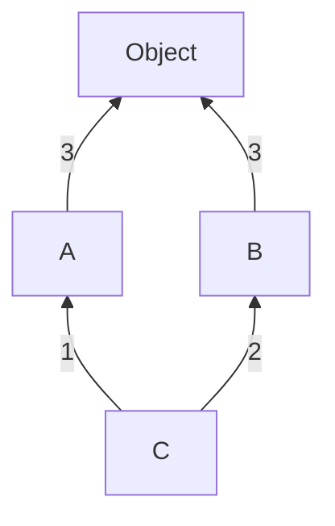

#  Learning Python 

| Contents                                            |
| :-------------------------------------------------- |
| [Exception Handling](#exception-handling)           |
| [OOPs in Python](#oops-in-python)                   |
| [Iterators and Iterables](#iterators-and-iterables) |

## Exception Handling

```python
try:
    num = int(input("Enter a number: "))
    result = 10 / num
except ZeroDivisionError:
    print("Cannot divide by zero.")
else:
    print(f"Result: {result}")  # Only executes if no exception occurs
finally:
    print(f"Result: {result}")  # Executes every time - Mostly utilized for clean up purposes
```

### Raising Exceptions Manually (`raise`)

```python
def check_age(age):
    if age < 18:
        raise ValueError("Age must be 18 or above.")
    return "Access granted."

try:
    print(check_age(16))
except ValueError as e:
    print(f"Error: {e}")
```

### Writing Custom Exceptions

```python
class FileProcessingError(Exception):
    def __init__(self, message, filename, lineno):
        super().__init__(message)
        self.message = message
        self.filename = filename
        self.lineno = lineno

    def __str__(self):
        # return f"{self.args[0]} in {self.filename} at line {self.lineno}" # if `self.message` is not declared inside `__init__`
        return f"{self.message} in {self.filename} at line {self.lineno}"

try:
    raise FileProcessingError("Syntax error", "example.txt", 13)
except FileProcessingError as e:
    print(f"Caught an error: {e}")
```

### Raising & Handling Multiple Exception Group (Python 3.11+ feature)

```python
# raising multiple exception group

def process_files():
    raise ExceptionGroup(
        "File Processing Errors",
        [
            FileNotFoundError("config.json not found"),
            PermissionError("Access denied for logs.txt"),
            ValueError("Invalid data format in data.csv"),
        ],
    )
process_files()
```

```python
# raising & handling multiple exception group
# check the way `except` is used
def process_files():
    errors = []

    try:
        # Simulating multiple errors
        raise ExceptionGroup(
            "File Processing Errors",
            [
                FileNotFoundError("config.json not found"),
                PermissionError("Access denied for logs.txt"),
                ValueError("Invalid data format in data.csv"),
            ],
        )
    except* FileNotFoundError as e:
        print(f"Handling FileNotFoundError: {e}")
    except* PermissionError as e:
        print(f"Handling PermissionError: {e}")
    except* ValueError as e:
        print(f"Handling ValueError: {e}")

process_files()
```

### Enriching Exceptions with Notes (Python 3.11+)

```python
try:
    with open("config.json", "r") as f:
        data = f.read()
except FileNotFoundError as e:
    e.add_note("Make sure the config.json file exists in the directory.")
    e.add_note("You might need to provide a correct file path.")
    raise

# Output

"""
Traceback (most recent call last):
  File "example.py", line 2, in <module>
    with open("config.json", "r") as f:
FileNotFoundError: [Errno 2] No such file or directory: 'config.json'
    Make sure the config.json file exists in the directory.
    You might need to provide a correct file path.
"""
```

Readings:

- [Errors and Exceptions (Official Docs)](https://docs.python.org/3/tutorial/errors.html)

## OOPs in Python

### Method Resolution Order

Check this [Stack Overflow](https://stackoverflow.com/a/62753514/12681221) answer to understand MRO.

**Different Case**

```python
class A:
    def __init__(self):
        print("Before - I am in Class A")
        super().__init__()
        print("I am in class A")

class B:
    def __init__(self):
        print("Before - I am in Class B")
        super().__init__()
        print("I am in class B")

class C(A,B):
    def __init__(self):
        print("Before - I am in Class C")
        super().__init__()
        print("I am in class C")

obj = C()
print(C.__mro__)

# Output

"""
Before - I am in Class C
Before - I am in Class A
Before - I am in Class B
I am in class B
I am in class A
I am in class C
(<class '__main__.C'>, <class '__main__.A'>, <class '__main__.B'>, <class 'object'>)
"""
```



Explanation:

1. ⁠When an instance of class `C` is created (`obj=C()`), it invokes the `__init__()` method of class `C`.
2. Inside the `__init__()` method of class `C`, it first prints `Before - I am in class C`.
3. Then, it calls `super().__init__()`, which invokes the `__init__()` method of the next class in the method resolution order (MRO) of class `C`, which is class `A`.
4. ⁠Inside the `__init__()` method of class `A`, it prints `Before - I am in class A`.
5. ⁠Then, it calls `super().__init__()`, which invokes the `__init__()` method of the next class in the MRO of class `C` (not class `A`), which is class `B`.
6. ⁠Inside the `__init__()` method of class `B`, it prints `Before - I am in class B`.
7. ⁠Then, it calls `super().__init__()`, which invokes the `__init__()` method of the next class in the MRO of class `C`, which is the built-in `object` class. Since `object` doesn't have an explicit `__init__()` method, it does nothing.
8. ⁠After the `super().__init__()` call in class `B`, it prints `I am in class B`.
9. The execution returns to class `A`, and after the `super().__init__()` call, it prints `I am in class A`.
10. Finally, the execution returns to class `C`, and after the `super().__init__()` call, it prints `I am in class C`.

The key point to understand is that when `super().__init__()` is called in class `A`, it doesn't transfer the execution to class `B` based on the inheritance between `A` and `B`. Instead, it looks at the MRO of the class where the instance is being created, which is class `C`. The MRO of class `C` determines the order in which the `super()` calls are resolved.

In this case, the MRO of class `C` is (`<class '__main__.C'>, <class '__main__.A'>, <class '__main__.B'>, <class 'object'>`). So, when `super().__init__()` is called in class `A`, it transfers the execution to the next class in the MRO after `A`, which is class `B`.

Readings:

- [Python Multiple Inheritance – Python MRO (Method Resolution Order)](https://data-flair.training/blogs/python-multiple-inheritance/)

## Iterators and Iterables

In Python, an **iterable** is any object capable of returning its members one at a time, allowing it to be iterated over in a for-loop. Common examples include lists, tuples, and strings. Simply put, _something that can be looped over._
Also, remember, if an object has special method `__iter__` in it, then it is iterable (use `dir` to verify it).

An **iterator** is an object representing a stream of data; it returns the data one element at a time. Iterators are implemented using two methods which together form the **_iterator protocol_**:

- `__iter__()`: Returns the iterator object itself.
- `__next__()`: Returns the next value from the iterator. If there are no more items to return, it raises a `StopIteration` exception.

The `iter()` function is used to get an iterator from an iterable, and the `next()` function is used to manually iterate through the items.

### Example of an Iterable

```python
my_list = [1, 2, 3]
for item in my_list:
    print(item)
```

### Example of an Iterator

```python
my_list = [1, 2, 3]
iterator = iter(my_list)

print(next(iterator))  # Output: 1
print(next(iterator))  # Output: 2
print(next(iterator))  # Output: 3
# print(next(iterator))  # Raises StopIteration
```

### Creating a Custom Iterator

```python
class MyIterator:
    def __init__(self, start, end):
        self.current = start
        self.end = end

    def __iter__(self):
        return self

    def __next__(self):
        if self.current >= self.end:
            raise StopIteration
        else:
            self.current += 1
            return self.current - 1

my_iter = MyIterator(1, 5)
for num in my_iter:
    print(num)
```

Readings:

- [Iterators and Iterables (Official Docs)](https://docs.python.org/3/tutorial/classes.html#iterators)
- [Iterator Types (Official Docs)](https://docs.python.org/3/library/stdtypes.html#typeiter)

## Generator

- Generators are a special class of functions that simplify the task of writing iterators. They allow you to declare a function that behaves like an iterator, i.e., it can be used in a for loop.

- Generators are defined using the def keyword like a normal function, but they use the yield statement to return data

- The yield statement pauses the function saving all its states and later continues from there on successive calls.

- Generators are memory efficient because they generate items one at a time and only when required, unlike lists which load all items into memory. In short, generators are lazy.

- Generators are useful for representing infinite sequences, such as data streams or large files, where you don’t want to load everything into memory at once.

```python
def count_up_to(max):
    count = 1
    while count <= max:
        yield count
        count += 1

counter = count_up_to(5)
print(counter)
for num in counter:
    print(num)

# Output

"""
<generator object count_up_to at 0x7099e19d5900>
1
2
3
4
5
"""
```

### Generator Expression

Similar to list comprehensions, but with parentheses instead of square brackets.

```python
my_generator = (x*x for x in range(5))
for value in my_generator:
    print(value)

# Output
"""
0
1
4
9
16
"""
```

Readings:

- [How to Use Generators and yield in Python](https://realpython.com/introduction-to-python-generators/)
